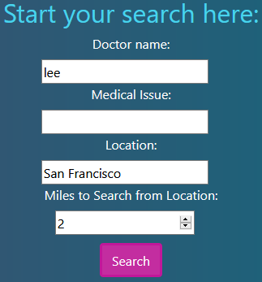

# _Doctor Lookup_

#### _Week 6 Independent Friday Assignment for Epicodus, 02.14.2020_

#### By _**Tiffany Siu**_

## Description

_This site is the Week 6 Friday independent assignment for Epicodus' full time Intro to Programming and C#/React course.  It is a site for a user to search for doctors in the city of Seattle by name or medical issue they are having using information from the [BetterDoctor API](https://developer.betterdoctor.com)._

_In this program a user will be able to search for doctors and receive their name, address, phone number, website, if they are accepting new patients, and a short bio on them. This program currently only shows the first 10 results or less, depending on how many search results were found and only shows the first practice site information if the doctor works at more than one practice site._ 

## Setup/Installation Requirements

### Requirements to Run
* _Web Browser_
* _Webpack_
* _Node.js_
* _NPM_
* _API KEY for BetterDoctor API_

### Instructions

*This page may be viewed by:*

1. Download and install Node.js from the [official website](https://nodejs.org/en/download/)
2. Clone the [repository](https://github.com/TSiu88/beep-boop.git) from my [GitHub page](https://github.com/TSiu88)
3. Use a command line/Bash to move to the project directory with `cd project-directory`
4. Run `npm install` to get all dependencies. 
5. Run `npm run start` to start up the program

Since this page uses an API, **an API KEY is required to use this program**.  An API Key can be gotten by:
1. Go to the site for [BetterDoctor API](https://developer.betterdoctor.com/) and sign up for a free API KEY
2. Create a new .env file in the root directory and type `API_KEY = (Add-API-Key-given-here)`
3. Allow program to refresh or run `npm run start` again to start up the program

## Other Technologies Used

* _HTML_
* _CSS_
* _Javascript_
* _JQuery 3.4.1_
* _Bootstrap 4.4.1_
* _ESLint_
* _Babel_
* _Jest_
* _Markdown_

## Notable Features
This program calls an API for information and dynamically adds profiles for the doctors found as they are found.  It also replaces values with "Not Available" if the information from the site is not provided.

## Specifications

* _If something goes wrong with the program's API call and results in an error (anything not a 200 OK), it returns a notification of the error._
  * _Example Input: API call_
  * _Example Output: error = 401 Error, API Key not valid_
* _User does not input any fields and clicks search, then search is only by location._
  * _Example Input: search=doctors, location=Seattle, name="", issue=""_
  * _Example Output: 7948 doctors found_
* _User enters a search for doctors but no doctors meet the criteria, so program returns a notification that no doctors that met the criteria were found._
  * _Example Input: search=doctors, location=Seattle, name=Chopper, medical issue=can't-get-on-this-island disease_
  * _Example Output: notification = No doctors that met the criteria were found_
* _User enters a search for doctors by name in a location and receives a list of doctors._
  * _Example Input: search=doctors, location=seattle, name=house_
  * _Example Output: 1 doctor found in Seattle, name=Houser_
* _User enters a medical issue and location and receives a list of doctors._
  * _Example Input: search=doctors, location=seattle, medical issue=sore throat_
  * _Example Output: 104 doctors found_
* _When doctors found, info on each doctor's name, address, phone number, website, if accepting new patients, and bio is displayed in results, if the information is available._
  * _Example Input: search=doctors, location=seattle, name=house_
  * _Example Output: name= Marc Houser, address: 15th Ave E, phone number=206326XXXX, website=not available, accepting new pts=true, bio=not available_

## Screenshots

_Here is a snippet of what the input looks like:_

_Here is a preview of what the output looks like:_

<!-- _{Show pictures using , show what library does as concisely as possible but don't need to explain how project solves problem from `code`_ -->

## Test Case Example
<!-- _Tests are done through Jest and are run from the command line prompt with `npm test`._
_Some example tests:_

 -->
<!-- _describe and show how to run tests with `code` examples}_ -->

## Known Bugs

_There are currently no known bugs in this program_

## Support and contact details

_If there are any question or concerns please contact me at my [email](mailto:tsiu88@gmail.com). Thank you._

### License

*This software is licensed under the MIT license*

Copyright (c) 2020 **_Tiffany Siu_**
